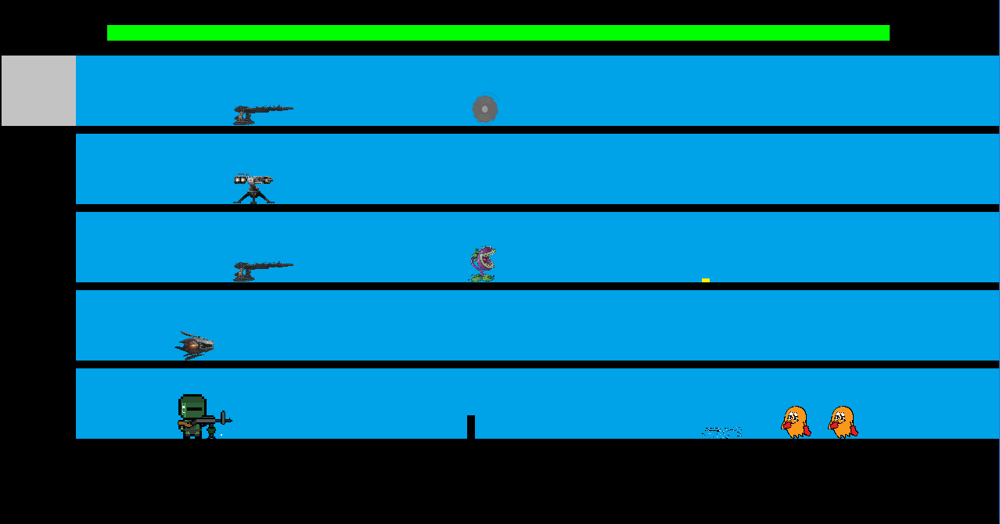
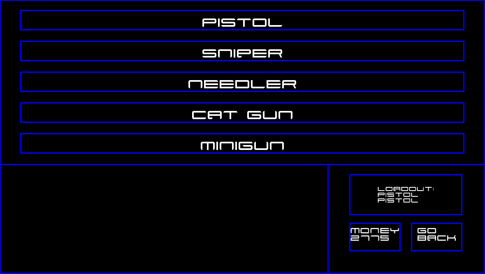

Floored is a game inspired by the Flash games I used to play during my childhood. It plays much like a tower defense, but with a twist: enemies can spawn on any of the 5 available floors. Your goal is to defend your base from 15 waves of enemies by using the elevator to traverse between the floors and eliminate them using a variety of towers and personal weapons. The game offers upgradable towers, traps, and additional weapons to aid in your goal. Can you survive?

For this project, my main role was to create/define the framework of the project. This includes creating the project structure, writing methods to define how the player interacts with the game, and how game assets are rendered then displayed on screen. We decided to use Visual Studios as our development environment and SFML to generate our graphics. Overall, the project ended up being over 50 various source files (.cpp and .h), 60 resources (SFX, sprites, BGM) and 2500+ lines of code. 

This project was one of the most critical steps in my software development career. It was here that I learned how to effectively use resources such as the internet or manuals to get a good understanding of how to solve certain problems. C++ has an amazing online reference manual known as [cppreference](https://en.cppreference.com/w/), and this website helped me solve countless problems with base C++. When it came to SFML, there were __a lot__ of issues; the most challenging one was determining why none of my sprites were showing up. After doing some online research, I learned that this is caused by the sprite getting unloaded as we left the scope. 

You can view the GitHub repository [here](https://github.com/Kayla-Kwock/floored).
