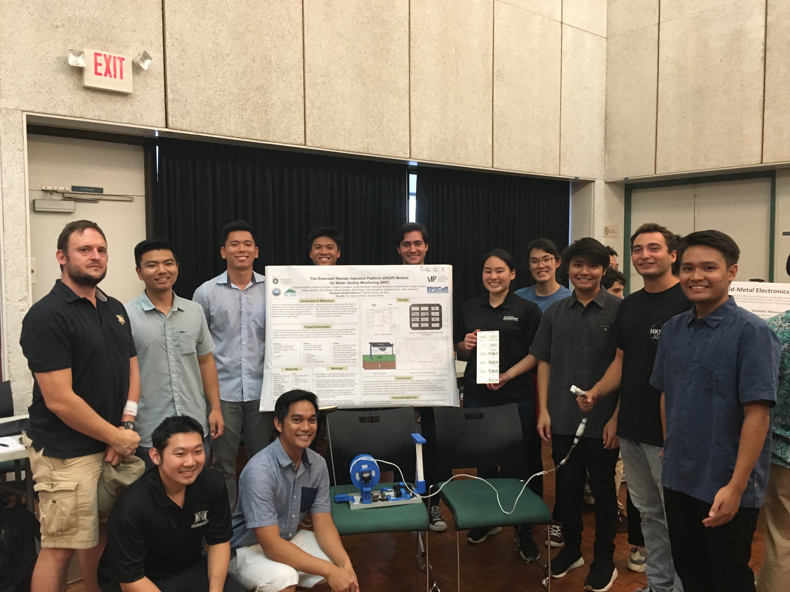

'Ike Wai is a multidisciplinary project that aims to provide better insights on the quality of Hawaii's water wells. Current solutions are expensive, time-consuming, and the final results don't go into depth. Our goal, as the Engineering branch, is to modernize and automate this process, as well as expand on the capabilities of what we can monitor. The solution is the DROP (Downwell Remote Operated Platform) module, which is fully encapsulated, off-the-grid package which can be deployed and left in the field so that the well can be monitored at anytime via wireless communication.

My role in this project is the lead of the Sensors Team, responsible for developing the sensor package that is lowered into the well to get the information. This includes organizing and wiring the circuits together to fit down the 1.5" diameter pipe and waterproofing them well enough to withstand up to 100ft of water pressure. To accomplish this, we've designed various 3D printable housings to encase the COTS sensors that measure temperature, salinity, flow rate and direction of the water, and if there are any bio-contaminants present. 

You can learn more about the [overall project here](http://www-ee.eng.hawaii.edu/~mmouse/about.html) or about the [DROP Module here](https://ikewaiuhmeng.wixsite.com/ikewai)

