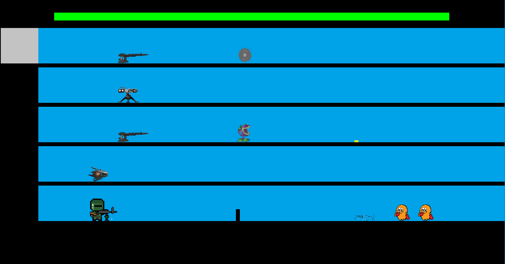

Floored is a game inspired by the Flash games I used to play during my childhood. It plays much like a tower defense, but with a twist: enemies can spawn on any of the 5 available floors. Your goal is to defend the elevator shaft from 15 waves of enemies by using the elevator to traverse between the floors and eliminate them using a variety of towers and personal weapons. The game offers upgradable towers, traps, and additional weapons to aid in your goal. Can you survive?

For this project, I worked as the leader of a team of 5. I created or defined the structure of the project, such as how the files are structured, how the player interacts with the game, and how the game interacts with itself. We decided to use Visual Studios as our development environment and SFML to generate our graphics. Overall, the project ended up being over 50 various source files (.cpp and .h), 60 resources (SFX, sprites, BGM) and 2500+ lines of code. 
